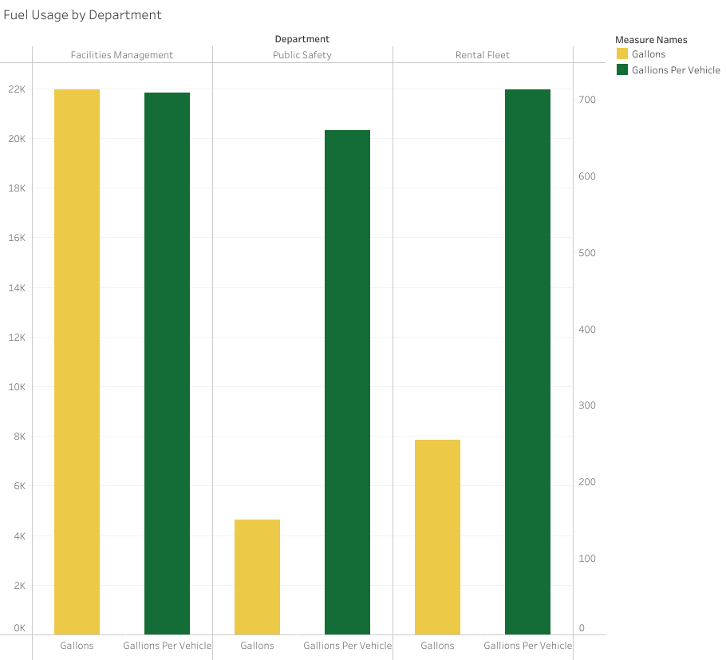
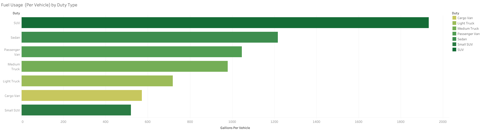
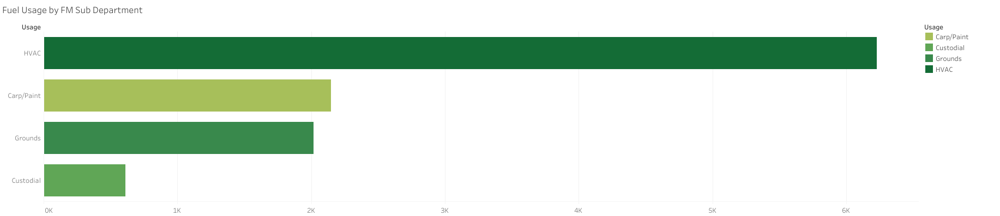
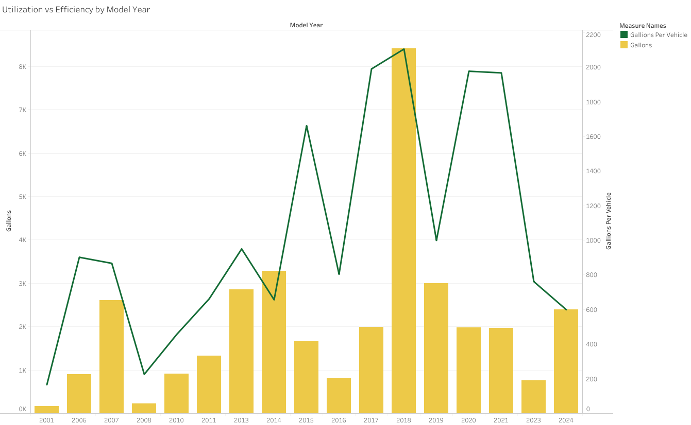
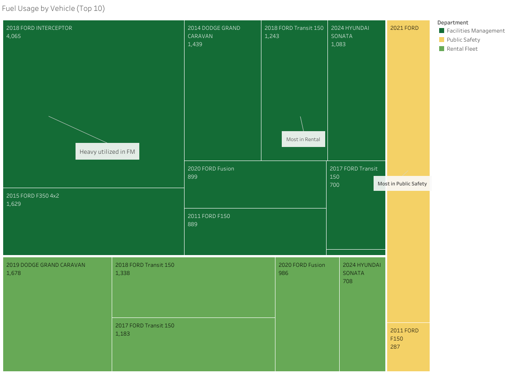

# UMN Morris Fleet Fuel Usage & EV Transition Analysis

##  Project Overview
This was a project I led during my time as a Sustainability Data Analyst Intern at the University of Minnesota.  
The project analyzes **three years of fleet ethanol billing data (FY22–FY24)** from the University of Minnesota - Morris Campus to identify **opportunities for electrification**.  
I consolidated billing records, standardized vehicle information, and developed a **prioritization framework** to rank vehicles for EV replacement.  

**Tools:** Excel, R (dplyr, tidyr, lubridate, readxl, writexl), Tableau  
**Deliverables:** Clean dataset, Tableau dashboard, prioritization scorecard  

---

##  Problem Statement
UMN as a system is committed to **carbon neutrality by 2050**.  
The Morris fleet contributes significantly to campus emissions, but **no unified dataset** existed for decision-making.  
This project answers:  
- Which departments and vehicle types consume the most fuel?  
- How do usage patterns compare across model years?  
- Which vehicles are the **best EV replacement candidates**?  

---

##  Data Workflow
Raw data: ethanol billing records (FY22–FY24), vehicle inventory list, grounds equipment list.  

**Key Cleaning Steps:**
- Standardized **Vehicle_IDs** (fixed leading zeros, merged across systems).  
- Classified **On Road vs Off Road** based on ID structure.  
- Harmonized **department codes** using already available `Dpt` and `Usage` columns.  
- Added vehicle attributes: **Duty Type, Model Year, Fuel Efficiency**.  
- Created derived fields: **Mileage = Gallons × Fuel Efficiency**, **Fiscal Year (FY)**.  

📂 Clean dataset exported as:  
[`data/Ethanol_Billing_Combined_Clean.xlsx`](data/Ethanol_Billing_Combined_Clean.xlsx)  

Scripts:  
- [`script/Cleaning.R`](script/Cleaning.R)  
- [`script/EV_Prioritization.R`](script/EV_Prioritization.R)  

---

##  Data Availability
The **original raw dataset** (ethanol billing and vehicle inventory records) is **not included in this repository due to privacy and institutional data-sharing restrictions**.  
Only processed/cleaned outputs and scripts are available here to illustrate the workflow and methodology.  

---

## 📊 Dashboard & Visuals
All visualizations built in **Tableau Public** (originally in Tableau Desktop):  
👉 [View Tableau Dashboard](https://public.tableau.com/app/profile/thai.bui1819/viz/MorrisFleetFuel/Dashboard?publish=yes)

### Key Insights:
1. **Fuel Usage by Department**  
     
   Facilities Management and Rental Fleet together consume ~85% of total gallons.  

2. **Duty Type**  
     
   SUVs and Sedans have the highest fuel usage per vehicle → strong EV pilot candidates.  

3. **FM Sub-Departments**  
     
   HVAC vehicles dominate Facilities’ fuel use.  

4. **Model Year**  
     
   Replace pre-2015 units with EVs as they retire, and prioritize high-use 2018–21 vehicles for pilots.  

5. **Utilization vs Efficiency by Department**  
     
   Facilities Management’s vehicles have the highest fuel usage as a fleet as well as on a per-vehicle basis.  

6. **Top Fuel-Consuming Vehicles**  
     
   Top 10 Vehicles in Fuel Usage identified on a treemap and categorized by Department.  

---

##  Prioritization Framework
I created a composite score to rank vehicles for EV replacement:  

**Priority Score = (0.30 * Age) + (0.25 * FuelUse) + (0.20 * Utilization) + (0.20 * EVFit) + (0.05 * Winter Suitability)**  

- **FuelUse**: share of total gallons (0–100).  
- **Utilization**: miles/year (estimated).  
- **Age**: years since model year (the older the vehicle, the higher the score).  
- **EVFit**: availability of EV products by duty type (e.g., sedans = high, medium trucks = low). EVFit scores were assigned based on global EV availability data. Light-duty vehicles (sedans, SUVs, vans) made up 99% of global EV sales in 2022, while heavy-duty vehicles (trucks, buses) represented only 1% of sales with availability concentrated in China and a few early-adopting regions (ICCT et al., 2023).  
- **Winter Suitability**: cold-weather reliability proxy. All EVs experience 25–40% range reduction in winter (American Automobile Association, 2019; NREL, 2025). Suitability varies by duty type not because of different technology, but because some duties (short local trips) can tolerate reduced range while others (long-haul, heavy-load, winter-critical operations) cannot.  

📂 Outputs:  
- [`output/Top10_Priority.xlsx`](output/Top10_Priority.xlsx) — top 10 vehicles with prioritization  
- [`output/EV_Transition_Prioritization.xlsx`](output/EV_Transition_Prioritization.xlsx) — full list with prioritization scores  

---

##  Recommendations
- **Departments**: Focus electrification pilots in **Facilities Management** and **Rental Fleet**.  
- **Vehicle Types**: Start with **SUVs, Sedans, and Cargo Vans**.  
- **Top 10 Vehicles**: Start looking at opportunities within this list.  
- Delay electrification of **Medium Trucks** until commercial EV options improve.  

---

##  Limitations
- Fuel billing records were collected across multiple sources without a standardized process, resulting in inconsistent IDs and department codes.  
- Several null values in niche fields (e.g., usage notes, sub-department tags) required assumptions and business rules.  
- Mileage estimated from fuel efficiency × gallons (no odometer data).  
- Charger proximity not yet included.  
- Winter suitability values based on secondary research (AAA 2019, DOE INL 2019).  
- Raw billing data not uploaded due to privacy.  

---

##  References
- American Automobile Association. (2019, February 7). *Cold Weather Reduces Electric Vehicle Range*. AAA Newsroom.  
  https://newsroom.aaa.com/2019/02/cold-weather-reduces-electric-vehicle-range/  

- Chu, Y., & Cui, H. (2023). *Annual update on the global transition to electric vehicles: 2022*. International Council on Clean Transportation (ICCT).  
  https://theicct.org/wp-content/uploads/2023/06/Global-EV-sales-2022_FINAL.pdf  

- Esparza, E., Truffer-Moudra, D., & Hodge, C. (2025). *Electric Vehicle and Charging Infrastructure Assessment in Cold Weather Climates: A Case Study of Fairbanks, Alaska*. National Renewable Energy Laboratory (NREL).  
  https://docs.nrel.gov/docs/fy25osti/92113.pdf  

---

👤 **Author**: Thai Bui  
📧 [LinkedIn](https://www.linkedin.com/in/thai-hoang-bui)  

